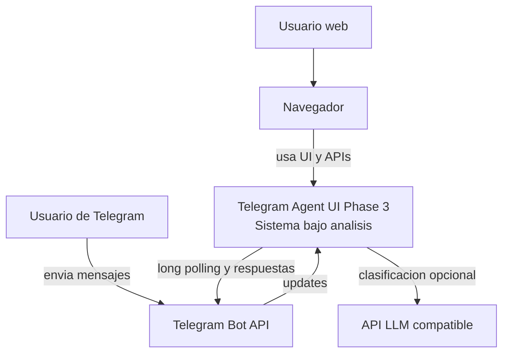

# 01. System Context

## Objetivo del sistema

El sistema permite consultar y gestionar un workspace de proyecto desde multiples canales: Telegram, una interfaz web de tareas y un chat web del asistente.

## Responsabilidad principal

- recibir solicitudes desde Telegram y desde navegador
- interpretar mensajes en lenguaje natural mediante un asistente compartido
- exponer APIs REST para tareas y chat
- mantener una fuente comun de estado del proyecto

## Fuera de alcance actual

- autenticacion y autorizacion de usuarios
- persistencia durable
- sincronizacion multiusuario avanzada
- aislamiento por canal o por chat
- backend corporativo real

## Personas y sistemas externos

### Personas primarias

- Usuario de Telegram: conversa con el bot.
- Usuario web: consulta tareas, crea tareas y usa el chat del asistente desde el navegador.

### Sistemas externos principales

- Telegram Bot API: entrega mensajes del bot.
- API LLM compatible con `chat/completions`: interpreta mensajes cuando AI esta habilitado.

### Sistemas de soporte

- Navegador web: consume la UI estatica y las APIs REST.
- Entorno de ejecucion: JVM local o contenedor Docker.

## Diagrama C1

## Interacciones clave

1. El usuario web abre la UI en `http://localhost:8080`.
2. La UI consulta tareas mediante REST y puede crear nuevas tareas.
3. El chat web envia mensajes al backend y recibe respuestas del mismo asistente usado por Telegram.
4. El usuario de Telegram interactua con el mismo workspace a traves del bot.

## Requerimientos funcionales implicitos en el codigo

- listar tareas desde la web
- crear tareas desde formulario web
- consultar el asistente desde el chat web
- consultar el mismo asistente desde Telegram
- mostrar resumen de sprint y carga
- filtrar tareas por responsable o estado

## Requerimientos no funcionales observables

- reutilizacion del core de negocio entre canales
- simplicidad didactica
- cero dependencias frontend complejas
- externalizacion de configuracion de Telegram y AI

## Hallazgos importantes

- La fase 3 no sustituye la fase 2; la encapsula y la expone por un canal adicional.
- La UI no tiene backend separado: los recursos estaticos son servidos por el mismo Spring Boot.
- Los tres canales comparten el mismo store en memoria y por lo tanto el mismo estado observable.
