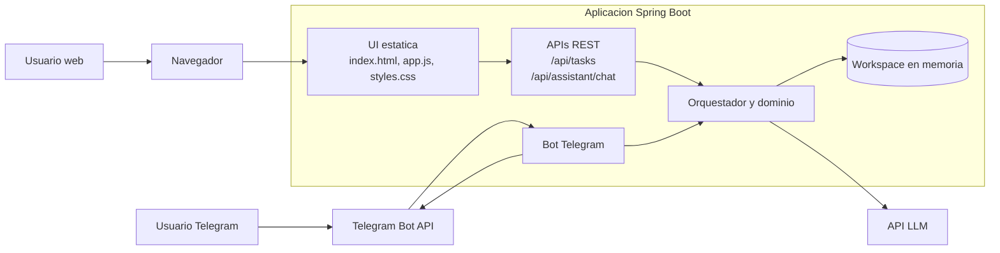
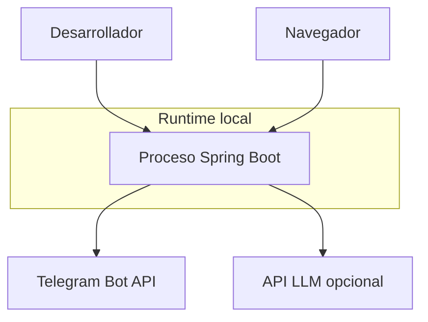

# 02. Container View

## Contenedores identificados

En esta fase ya existen contenedores logicos diferenciados dentro de una sola aplicacion desplegable.

### 1. Backend Spring Boot

- Tipo: aplicacion principal.
- Tecnologia: Java 17, Spring Boot 3.3.5.
- Responsabilidad: bot Telegram, APIs REST, orquestacion de agente y acceso al workspace.

### 2. UI web estatica

- Tipo: frontend servido por el backend.
- Tecnologia: HTML, CSS y JavaScript vanilla.
- Responsabilidad: mostrar tareas, crear tareas y exponer un chat web.

### 3. Telegram Bot API

- Tipo: sistema externo.
- Responsabilidad: entregar y recibir mensajes del canal Telegram.

### 4. API LLM compatible

- Tipo: sistema externo opcional.
- Responsabilidad: clasificar mensajes a intenciones estructuradas.

### 5. Workspace store en memoria

- Tipo: almacenamiento embebido.
- Tecnologia: `CopyOnWriteArrayList<TaskItem>` y objetos en proceso.
- Responsabilidad: almacenar tareas y sprint actual compartidos entre canales.

## Diagrama C2

## Relaciones entre contenedores

### UI web -> APIs REST

- Protocolo: HTTP same-origin.
- Motivo: listar tareas y conversar con el asistente sin depender de Telegram.

### Bot Telegram -> Core del asistente

- Patron: long polling + invocacion interna.
- Motivo: reutilizar el mismo comportamiento de fase 2.

### APIs REST -> Core del asistente y dominio

- `TaskController` expone acciones CRUD parciales sobre tareas.
- `AssistantController` expone el asistente como servicio HTTP.

### Core -> API LLM

- Patron: request/response HTTP opcional.
- Motivo: interpretacion de lenguaje natural.

### Core -> Store en memoria

- Patron: llamada interna a `ProjectWorkspaceService`.
- Motivo: compartir estado entre canales.

## Diagrama de despliegue simplificado

## Observaciones de capacidad

- Esta fase agrega concurrencia de acceso porque web y Telegram comparten estado.
- El uso de `CopyOnWriteArrayList` es suficiente para demo, pero no escala bien con escrituras frecuentes.
- La UI depende completamente del backend mismo; no hay separación de despliegue frontend/backend.
