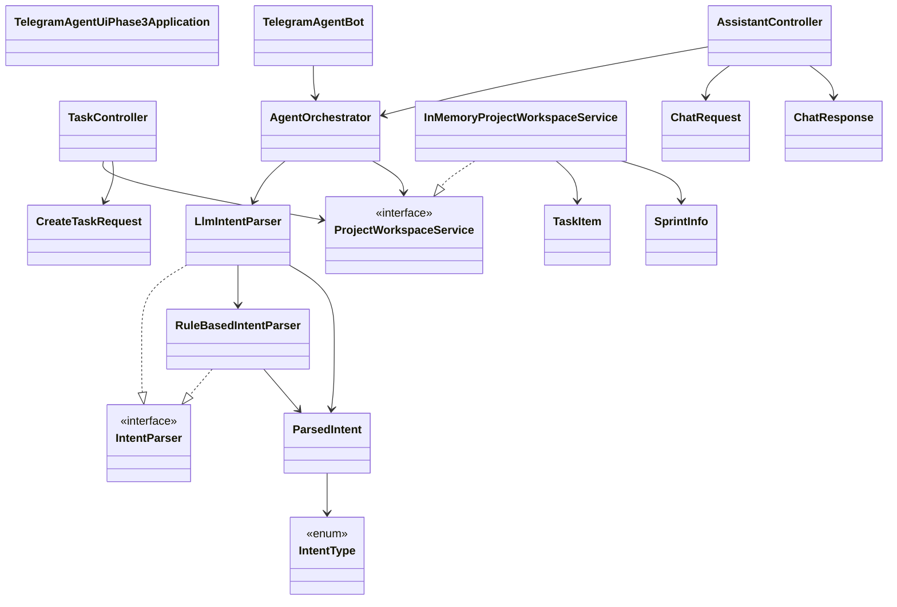
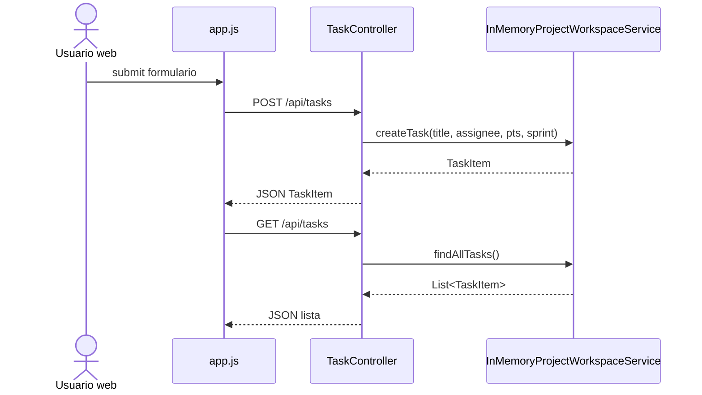
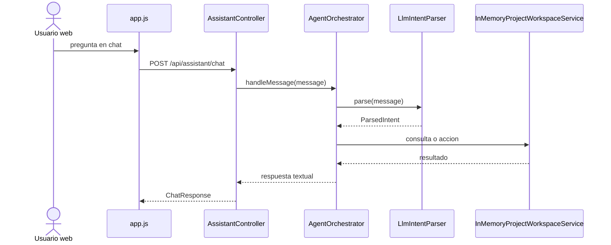
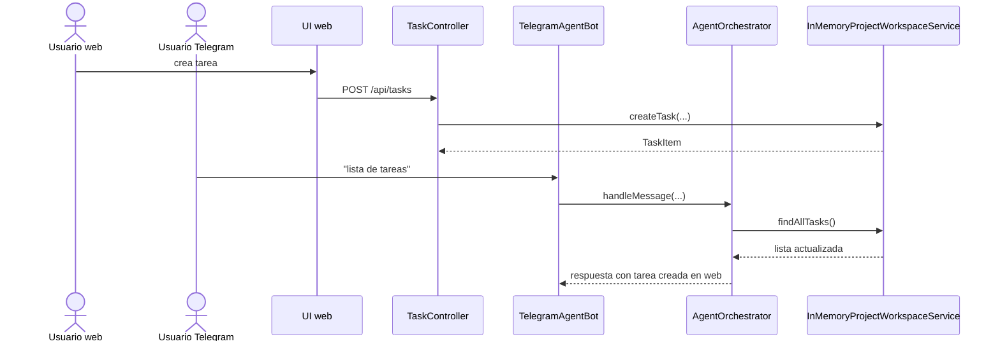

# 04. Code View

## Vista de codigo

El diseño de codigo de fase 3 extiende la fase 2 con controladores REST, DTOs y una UI estatica.

## Diagrama de clases

## Diagrama de secuencia: crear tarea desde web

## Diagrama de secuencia: chat web

## Diagrama de secuencia: estado compartido entre canales

## Mapeo codigo -> capas

| Capa | Elementos | Comentario |
|---|---|---|
| Bootstrap | `TelegramAgentUiPhase3Application` | inicializa todo el sistema |
| Canal Telegram | `TelegramAgentBot` | integra mensajeria Telegram |
| API REST | `TaskController`, `AssistantController`, DTOs | expone tareas y chat |
| Aplicacion | `AgentOrchestrator` | orquesta intenciones y dominio |
| NLU | `IntentParser`, `LlmIntentParser`, `RuleBasedIntentParser`, `ParsedIntent`, `IntentType` | interpreta lenguaje natural |
| Dominio | `ProjectWorkspaceService`, `TaskItem`, `SprintInfo` | herramientas y entidades del proyecto |
| Persistencia demo | `InMemoryProjectWorkspaceService` | estado compartido |
| Frontend | `index.html`, `app.js`, `styles.css` | interfaz de usuario |

## Puntos de extension

- reemplazar la UI vanilla por un frontend desacoplado
- exponer mas endpoints REST
- reutilizar `AgentOrchestrator` en otros canales como Slack o WhatsApp
- cambiar `ProjectWorkspaceService` por backend real
