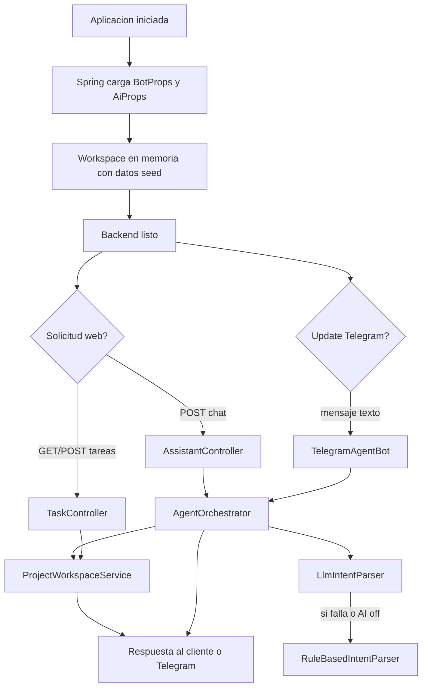
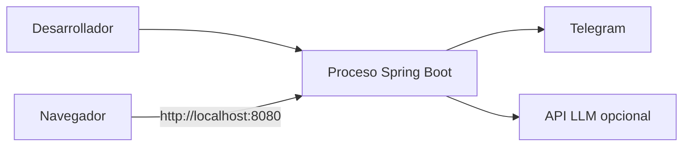

# 05. Runtime y Deployment

## Runtime actual

La fase 3 corre como una sola aplicacion Spring Boot que atiende tres flujos de entrada:

1. Telegram
2. UI web de tareas
3. chat web del asistente

## Flujo runtime multicanal

## Flujos principales

### Flujo A. Gestion de tareas por UI

- El navegador carga `index.html`, `styles.css` y `app.js`.
- `app.js` consulta `GET /api/tasks`.
- El usuario envia el formulario y el frontend hace `POST /api/tasks`.
- La lista se vuelve a consultar y renderizar.

### Flujo B. Chat web

- El usuario escribe en el panel de chat.
- `app.js` hace `POST /api/assistant/chat`.
- `AssistantController` delega al `AgentOrchestrator`.
- La respuesta textual vuelve como JSON.
- La UI refresca tambien la lista de tareas por si hubo cambios.

### Flujo C. Telegram

- El bot consulta updates por long polling.
- `TelegramAgentBot` envia el texto al mismo `AgentOrchestrator`.
- El mensaje de salida se publica en Telegram.

## Deployment local

## Deployment Docker

### Caracteristicas

- Imagen base: `eclipse-temurin:17-jre`
- Artefacto esperado: `target/telegram-agent-ui-phase3-0.1.0.jar`
- Entry point: `java -jar /app/app.jar`

## Artefactos servidos por el backend

| Tipo | Ruta | Funcion |
|---|---|---|
| UI | `/` | pagina principal |
| API | `/api/tasks` | listar y crear tareas |
| API | `/api/assistant/chat` | conversar con el asistente |

## Implicaciones operativas

- Un solo proceso sirve frontend, APIs REST y bot Telegram.
- El estado del workspace es comun para todos los canales.
- Si el proceso reinicia, se pierden las tareas creadas y vuelve el seed inicial.
- No se observo manifiesto Kubernetes en esta iteracion; el despliegue documentado por el proyecto es local y por Docker.

## Observabilidad actual

### Existe

- logs configurables por paquete
- log de registro del bot
- warning ante fallo del parser LLM
- error al fallar envio a Telegram

### No existe aun

- logs de acceso HTTP
- metricas por endpoint
- metricas por canal
- health checks
- pruebas end-to-end UI/API

## Escenarios de falla

| Escenario | Efecto | Mitigacion actual | Recomendacion |
|---|---|---|---|
| backend caido | no hay UI, APIs ni bot | ninguna | health checks y supervision |
| AI no disponible | el chat sigue pero con fallback local | parser rule-based | esperado |
| datos concurrentes desde web y Telegram | estado compartido mutable | `CopyOnWriteArrayList` | persistencia real y control transaccional |
| frontend recibe error HTTP | no se maneja visualmente | ninguna | manejo de errores en `app.js` |
