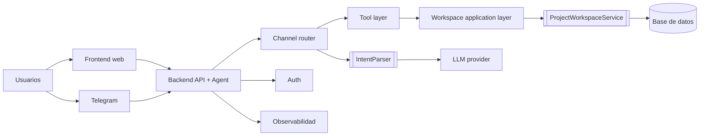

# 06. Decisiones, Riesgos y Evolucion

## Decisiones arquitectonicas principales

## Decision 1. Reutilizar el mismo `AgentOrchestrator` en multiples canales

### Beneficios

- evita duplicacion de reglas
- demuestra claramente la separacion entre canal y logica de asistente
- facilita agregar nuevos canales

### Trade-off

- las respuestas estan optimizadas para texto plano y no para experiencias especificas por canal

## Decision 2. Servir UI y backend desde el mismo Spring Boot

### Beneficios

- despliegue simple
- onboarding rapido
- misma base de codigo para frontend y backend

### Trade-off

- no hay independencia de escalado ni de ciclo de despliegue frontend/backend

## Decision 3. Exponer REST para tareas y chat

### Beneficios

- hace visible el backend como plataforma reutilizable
- permite integrar otras interfaces mas alla de Telegram
- mantiene contratos simples

### Trade-off

- no hay validaciones ni manejo de errores HTTP avanzado

## Decision 4. Compartir store en memoria entre todos los canales

### Beneficios

- demuestra coherencia funcional inmediata
- muy facil de entender en clase

### Trade-off

- no hay durabilidad
- no hay aislamiento entre usuarios
- la concurrencia real es limitada

## Riesgos actuales

| Riesgo | Severidad | Descripcion |
|---|---|---|
| perdida de datos | alta | reiniciar el proceso restaura solo datos seed |
| falta de autenticacion | alta | cualquier consumidor local podria usar APIs y ver estado |
| UX fragil en frontend | media | `app.js` no muestra errores de red o backend |
| cobertura automatizada ausente | alta | no se encontro `src/test` |
| acoplamiento a respuestas textuales | media | la salida del orquestador no distingue entre Telegram y web |
| escalabilidad limitada | media | un solo proceso atiende UI, APIs, chat y Telegram |

## Deuda tecnica visible

- `AssistantController` devuelve solo texto, sin metadata de intencion o acciones.
- `TaskController` no valida payloads ni campos requeridos.
- `app.js` hace fetch sin manejo de excepciones ni estados de carga.
- `AgentOrchestrator` sigue dependiendo concretamente de `LlmIntentParser`.
- No hay versionado de API ni contrato OpenAPI.

## Roadmap recomendado

## Fase 1. Endurecer la experiencia web

- manejar errores HTTP en `app.js`
- agregar estados de carga
- validar formularios en backend y frontend
- mostrar feedback de exito y error

## Fase 2. Profesionalizar el backend

- hacer depender al orquestador de `IntentParser`
- agregar validacion a DTOs
- introducir respuestas estructuradas del asistente
- agregar pruebas para controladores y servicios

## Fase 3. Sustituir la persistencia demo

- mover `ProjectWorkspaceService` a una implementacion real
- agregar identificacion por usuario, canal o equipo
- persistir tareas y sprints

## Fase 4. Evolucion multicanal real

- agregar mas canales de mensajeria
- separar frontend del backend si el sistema crece
- agregar observabilidad y seguridad

## Arquitectura objetivo sugerida

## Conclusiones

La fase 3 completa la evolucion pedagogica del proyecto: de bot por comandos, a bot-agente, y finalmente a plataforma multicanal con UI web. Su principal valor arquitectonico es demostrar que el asistente no pertenece a Telegram, sino al core del sistema.
