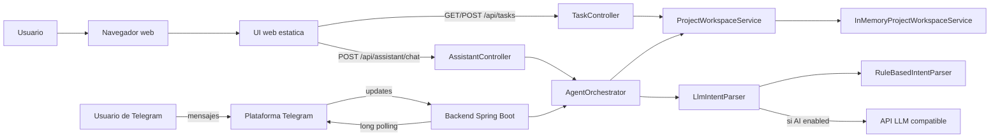

# Arquitectura C4 - Telegram Agent UI Phase 3

Esta carpeta documenta la arquitectura del proyecto `telegram-agent-ui-phase3` siguiendo el modelo C4.

## Contenido

1. [01-system-context.md](./01-system-context.md)
   Vista de contexto del sistema, actores y sistemas externos.
2. [02-container.md](./02-container.md)
   Vista de contenedores logicos y de despliegue principal.
3. [03-component.md](./03-component.md)
   Vista de componentes internos del backend y frontend.
4. [04-code.md](./04-code.md)
   Vista de codigo, clases principales y relaciones.
5. [05-runtime-deployment.md](./05-runtime-deployment.md)
   Flujos runtime multicanal, APIs y despliegue.
6. [06-decisions-risks.md](./06-decisions-risks.md)
   Decisiones arquitectonicas, trade-offs, riesgos y evolucion recomendada.

## Resumen ejecutivo

`telegram-agent-ui-phase3` es una aplicacion Spring Boot multicanal que combina bot de Telegram, API REST, UI web y chat web. Reutiliza el mismo `AgentOrchestrator` para interpretar y responder solicitudes desde Telegram o desde el navegador, y expone una API de tareas para gestion directa desde la interfaz web.

## Diagrama global

## Alcance

La documentacion refleja el comportamiento actual del codigo fuente:

- Aplicacion Java 17 con Spring Boot 3.3.5.
- Canal Telegram por long polling.
- API REST para tareas y chat del asistente.
- UI web estatica servida por Spring Boot.
- Orquestador compartido entre Telegram y chat web.
- Workspace demo en memoria compartido por todos los canales.
- Parser AI configurable con fallback local.

## Fuentes analizadas

- `pom.xml`
- `src/main/java/com/oraclebot/phase3/TelegramAgentUiPhase3Application.java`
- `src/main/java/com/oraclebot/phase3/config/BotProps.java`
- `src/main/java/com/oraclebot/phase3/config/AiProps.java`
- `src/main/java/com/oraclebot/phase3/bot/TelegramAgentBot.java`
- `src/main/java/com/oraclebot/phase3/agent/AgentOrchestrator.java`
- `src/main/java/com/oraclebot/phase3/agent/IntentParser.java`
- `src/main/java/com/oraclebot/phase3/agent/LlmIntentParser.java`
- `src/main/java/com/oraclebot/phase3/agent/RuleBasedIntentParser.java`
- `src/main/java/com/oraclebot/phase3/agent/ParsedIntent.java`
- `src/main/java/com/oraclebot/phase3/agent/IntentType.java`
- `src/main/java/com/oraclebot/phase3/controller/TaskController.java`
- `src/main/java/com/oraclebot/phase3/controller/AssistantController.java`
- `src/main/java/com/oraclebot/phase3/service/ProjectWorkspaceService.java`
- `src/main/java/com/oraclebot/phase3/service/InMemoryProjectWorkspaceService.java`
- `src/main/java/com/oraclebot/phase3/model/TaskItem.java`
- `src/main/java/com/oraclebot/phase3/model/SprintInfo.java`
- `src/main/java/com/oraclebot/phase3/dto/CreateTaskRequest.java`
- `src/main/java/com/oraclebot/phase3/dto/ChatRequest.java`
- `src/main/java/com/oraclebot/phase3/dto/ChatResponse.java`
- `src/main/resources/application.properties.example`
- `src/main/resources/static/index.html`
- `src/main/resources/static/app.js`
- `src/main/resources/static/styles.css`
- `Dockerfile`
- `README.md`
